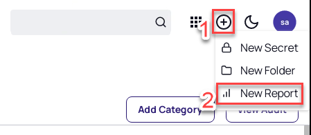
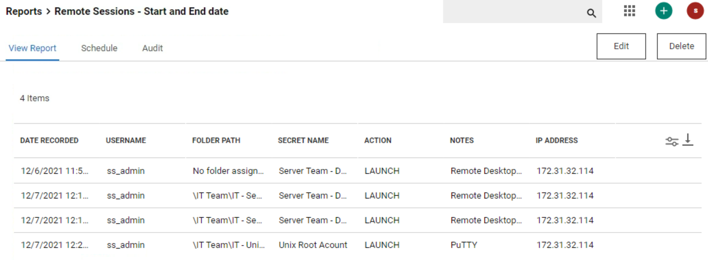
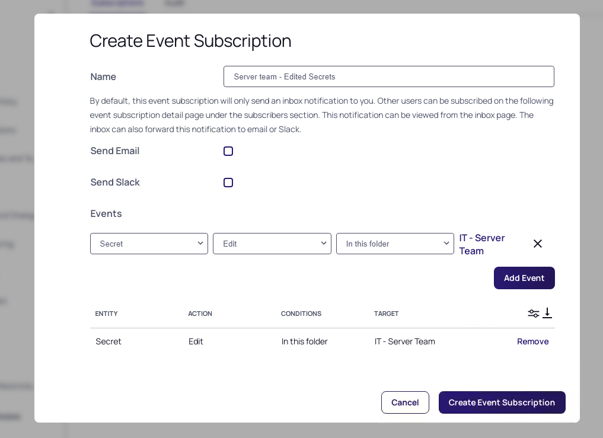
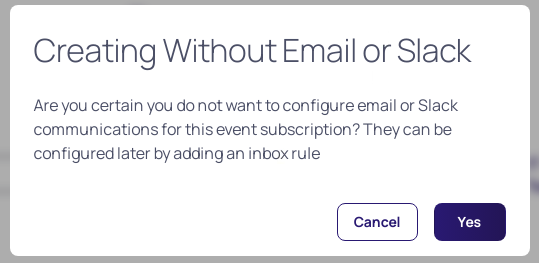
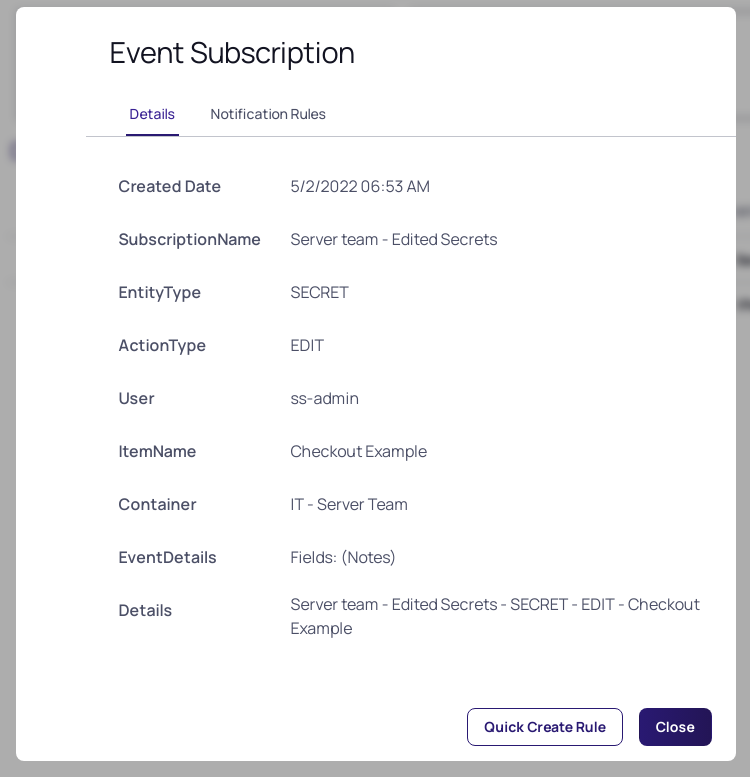
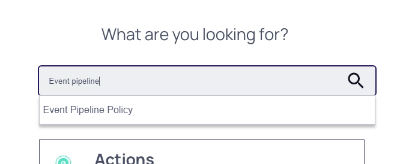
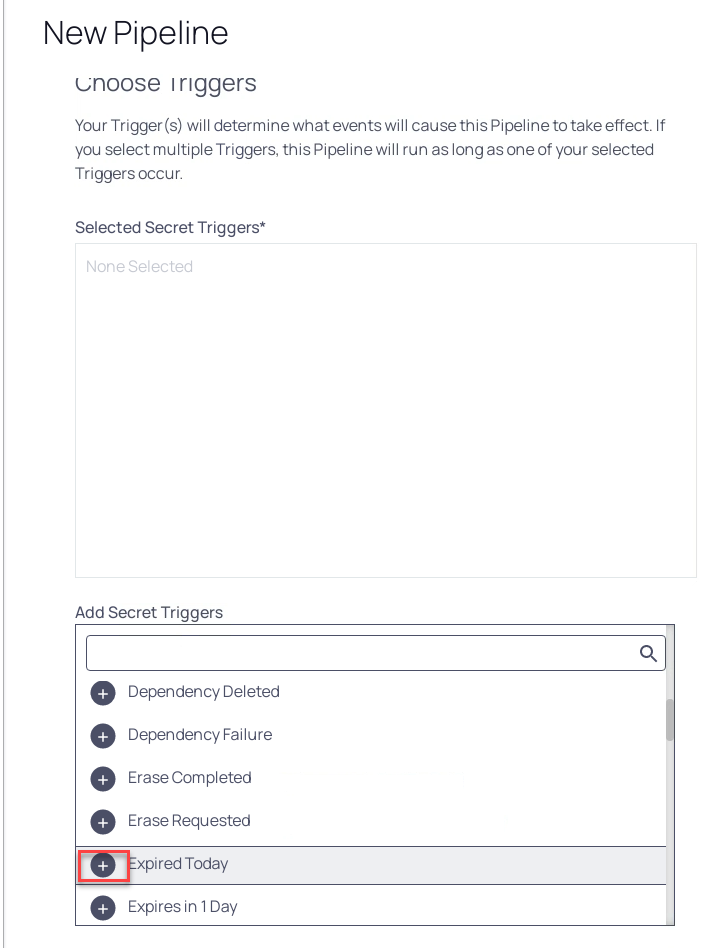
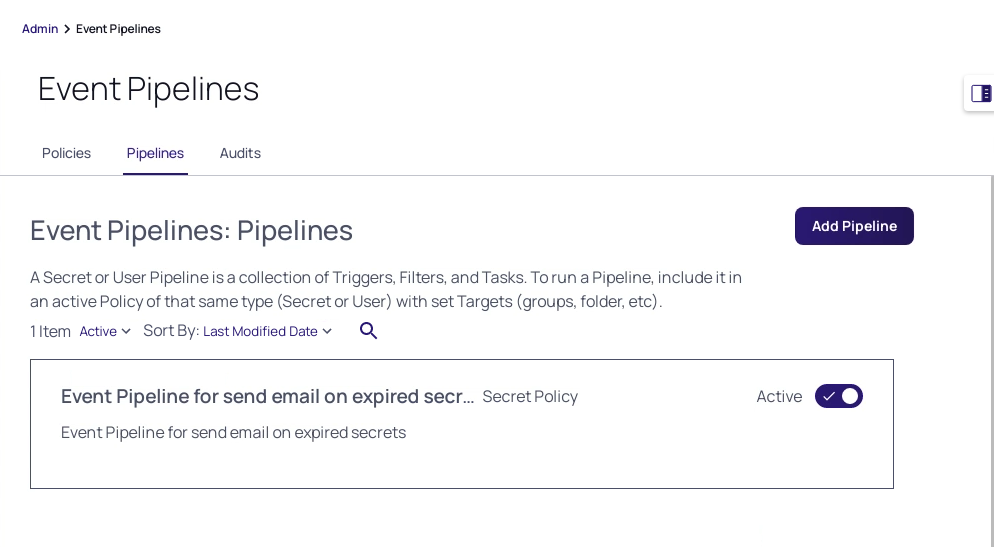

# Auditing and Security

## Introduction

This tenth and last module will cover:

1. Overview
2. Secret Server Reporting
3. Event Subscriptions and Event Pipeline
4. SIEM integration
5. Privileged Behavior Analytics (PBA)
6. Session Recording and Monitoring

## Auditing and Security Overview

In this module we will explore a range of auditing and security functionality within Secret Server. This area is of particular importance as most Delinea Secret Server customers use this functionality to ensure they adhere to various internal and external compliance regulations.

## Secret Server Reporting

Secret Server provides a comprehensive range of audit reports out of the box. The available reports are designed to help users answer questions about secrets, users, compliance and administrative behaviour.

To view reports, select the Reports button from the left-hand column. On the reporting page there are three tabs, General, Security Hardening, User Audit.

- General – Contains a range of reports separated into different areas such as Activity, Secrets, Password compliance etc.
- Security Hardening – Contains the security hardening report which we have previously used to identify and configure security configuration to harden the Secret Server installation
- User Audit – Contains a report to monitor specific user activity and expire and secrets a targeted user has interacted with.
- Schedules - Show scheduled reports

Although the out of the box reports provide most customers with all the visibility and intelligence they typically need, it is possible to create custom reports within the Secret Server interface. In the next lab exercise we will configure a custom report.

### Lab 25 – Configuring a Custom Report

1. Click the **+** icon in the top right-hand corner and click **New Report**

    

2. Configure the report with the following detail:

    - **Name:** Remote Sessions – Start and End date

    - **Description:** Shows the start and end date detail of all remote sessions launched from Secret Server

    - **Category:** User

    - **Page Size:** 15

    - **Use Database Paging:** Checked

    - **Chart Type:** None

    - **Report SQL:** Paste the following

      ```sql
      SELECT
          a.DateRecorded AS [Date Recorded],
          upn.displayname AS [Username],
          ISNULL(f.FolderPath, N'No folder assigned') as [Folder Path],
          s.secretname AS [Secret Name],
          a.Action,
          a.Notes,
          a.ipaddress As [IP Address]
      FROM tbAuditSecret a WITH (NOLOCK)
      INNER JOIN tbUser u WITH (NOLOCK)
          ON u.UserId = a.UserId
      INNER JOIN vUserDisplayName upn WITH (NOLOCK)
          ON u.UserId = upn.UserId
      INNER JOIN tbsecret s WITH (NOLOCK)
          ON s.SecretId = a.SecretId
      LEFT JOIN tbFolder f WITH (NOLOCK)
          ON s.FolderId = f.FolderId
      Where
      a.action like '%Launch'
      ```

3. Click **Save**

4. If you ran all steps from all the earlier labs, sessions have been launched that match the criteria and should now be shown in the custom report

    

## Event Subscriptions

Secret Server can be configured to generate an Event Subscription or alert for virtually any action that is carried out within the system. This functionality means that whenever a particular action is performed, a defined list of users (or email distribution groups) can be notified automatically

!!!Warning
    Delinea recommends using Event Subscriptions sparingly, if users are bombarded with too many alerts they can quickly be perceived as spam and loose importance.

### Lab 26 – Configuring an Event Subscription

In this exercise we will configure an event subscription that will alert specific users if any secret in the IT – Server Team folder is edited.

!!!Note
    The training lab does not currently contain an SMTP server so this event subscription can be configured but will not generate any email alerts.


01. Navigate to the **Administration > Actions > Event Subscriptions**

02. Click **Create Event Subscription**

03. Create a new subscription with the following configuration.

    - **Event Subscription Name:** Server Team – Edited Secrets
    - **Send Email:** Unchecked (can not be changed due to missing configuration)
    - **Send Slack:** Unchecked (can not be changed due to missing configuration)
    - **Events:** *Secrets > Edit > In this folder > IT - Server Team*

04. Click **Add Event**

05. Your configuration should match the image below:

    

06. Click **Create Event Subscription**

07. In the *Creating Without Email or Slack* message, click **Yes**

    

08. To test the subscription, edit a secret in the *IT – Server Team* folder by adding to the *notes* section "Test to trigger the Event Subscription".

09. The event will be visible in the **Notification** of the ss_admin user. Click **Inbox** in the navigation bar and select **Notification**. There you will see event.

    

    !!!Note
        This due to the fact that under the just created Event Subscription, under *Subscribers* the ss_admin account is mentioned (the default)

10. Click on the Event Subscription line and see the details. You can see which field(s) has/have been changed in the *EventDetails* section.

    

11. Click **Close**

### Lab 27 – Configuring an Event Pipeline

In this example exercise we will send an Email to the Secret Owner on the basis of Expiry

Creating and Configuring and Event Pipeline consists of 4 basic steps – Creating the 

*Event Pipeline > Add Triggers > Add Filters > Choose Tasks*

#### Step One: Create the Event Pipeline

1. Navigate to **Administration > Search bar type "Event Pipeline"**

2. Click **Event Pipeline policy** in the search results

    

3. Click the *Pipelines* tab. Select **Add Pipeline**

4. Select **Pipeline Type:** Secret

5. Click **Create**

6. The Choose Triggers page appears

#### Step Two: Add Triggers

1. In the *Add Secret Triggers* section, click the *+* in the green circle next to the **Expired Today** trigger.

    
    !!!Note
        You can also search for a trigger by typing in the search text box. The selected triggers appear in the Selected Triggers list.)

2. Click **Next**

3. The Choose Filters page of the wizard appears.

#### Step Three: Add Filters

1. Use the exact same method to Select the filter to the Event Pipeline. All filters present a popup page for you to provide additional information when you click on them.

2. Click the *+* in the green circle next to the **Secret Name**

    

3. Leave *Value Match type* as **Equals**

4. In the *Value* box enter the name **RFA Example**

5. Click **Save**. The Choose Filters page of the wizard appears

6. Click **Next**. The Choose Tasks page of the wizard appears

#### Step Four: Choose Tasks

01. Use the exact same method to add **Secret: Send Email to Owners** task to the Event Pipeline. Many tasks present a popup page for you to provide additional information when you click on them.

02. Set *Secret Access Role Permission* to **Owner**

03. Set *Subject Pattern* to **This Secret has now Expired**

04. Set *Email Body Pattern* to **This Secret has now Expired**

05. Leave the *High Priority* unchecked

    !!!Warning
        Tasks are very powerful and thus can be dangerous. You can alter Secret Server in dramatic, sometimes irreversible ways. We strongly recommend testing Event Pipelines in a safe sandbox environment before applying them to production Secret Server servers.

06. Click **Save**. The Choose Tasks page of the wizard appears

07. Click **Next**

08. In the *Pipeline Name* type **Event Pipeline for send email on expired secrets**

09. In the *Pipeline Description*  type **Event Pipeline for send email on expired secrets**

10. Click **Save**

11. You will be presented with the Event Pipelines: Pipelines and it is *Active*

    

!!!Note
    More detailed information on Event Pipelines can be found at <https://docs.delinea.com/ss/11.1.0/events-and-alerts/event-pipelines/index.md>
