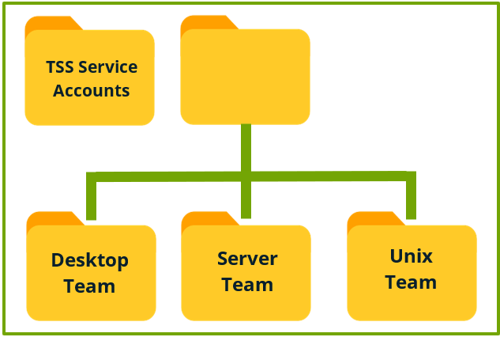
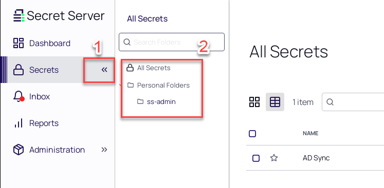
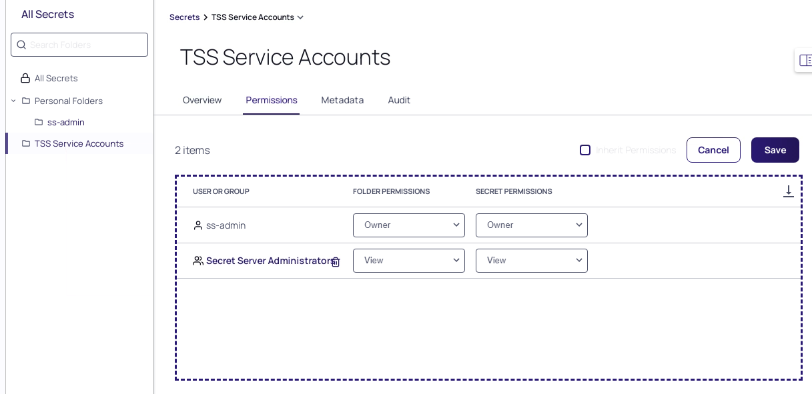
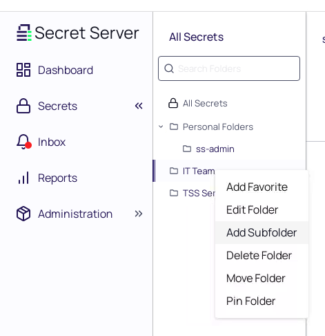
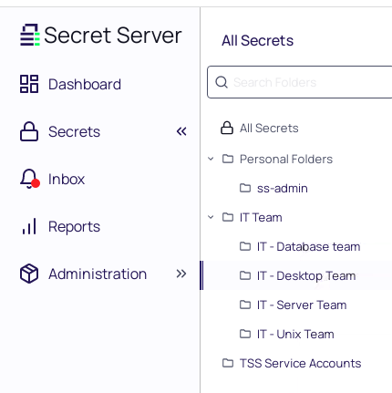
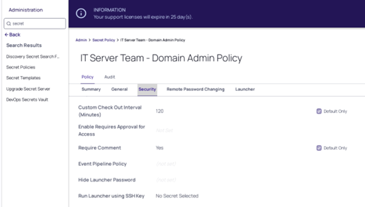
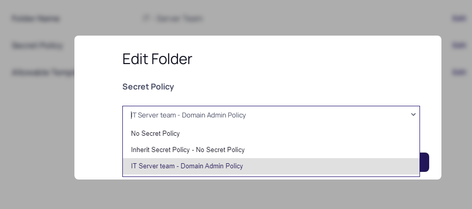
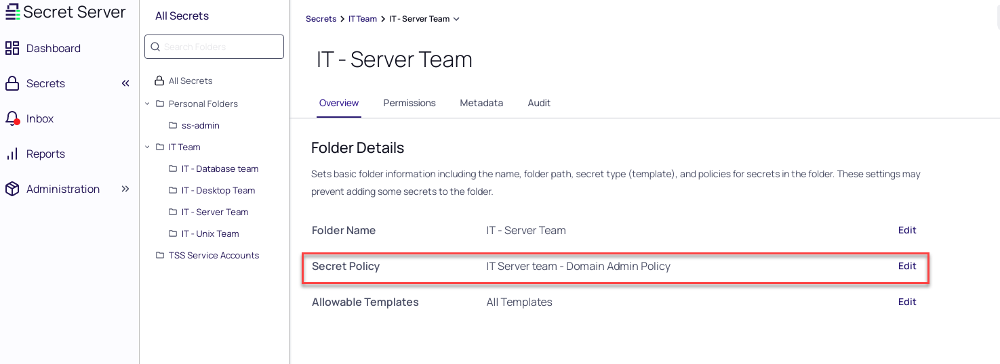

# Folder and Policies

## Introduction

This fourth module will cover:

1. Secret Folder Structure
2. Secret Policy

### Secret Folder Structure

Before starting to add Secrets into Secret Server, it is essential that that a well-planned folder structure is created. A well planned, effective folder structure not only provides the ability to keep all secrets organized but it also allows for the effective use of security policies.

Security settings can be applied to individual secrets but with hundreds or thousands of secrets managing security on each secret does not scale. The way folder structures work in Secret Server is very similar to NTFS folder and file permissions in the Microsoft Windows world

**Discussion Point:**

 At this point your trainer will discuss common approaches to planning your folder structure.

In this module we will be creating a basic folder structure for the IT team and applying secret policies to the folder to ensure users only have access to Secrets they require in their role.

### Lab 11 - Creating Secret Folders

01. In the left hand column of the homepage, expand the **Secrets** by clicking on the double arrow button.

    

02. Click the **+** icon in the top right corner and click **Add Root** Folder

    

03. Give the new folder a name of **TSS Service Accounts**

04. Click **Create New Folder** button

05. Right-Click the new folder and click **Edit Folder**

06. Click the **Permissions** tab

07. Click **Edit**

08. Add the **Secret Server Administrators** group and give the group **View/View** permissions (default)

    

09. Click **Save**.

10. Click **All Secrets** and click the **+** icon in the top right corner amd select **New Folder**

11. Give the new folder a name of **IT Team**

12. Click **Create New Folder**

13. Right-Click the new folder and click **Edit Folder**

14. Click the *Permissions* tab

15. Click **Edit** next to *Folder Permissions* and

    - **Inherit Permissions:** Unchecked (left next to the Edit button. as this is a root folder, it can't be changed)

    - Add the following groups with **View/View** rights

      - IT Database Team
      - IT Desktop Team
      - IT Server Team
      - IT Unix Team
      - Secret Server Administrators

16. Click **Save**

17. Right-Click the IT-Team Folder and click Add Sub Folder

    

18. Create a new folder with the name: **IT - Desktop Team**

19. Click **Create New Folder**

20. Right-Click the new folder and click **Edit Folder**

21. Click the *Permissions* tab and click **Edit** and

    - **Inherit Permission**: unchecked

    - Remove all but the following groups by hovering over the groupnames and clicking the Bin icon (remove) and give these groups **View/View** rights

      - IT Desktop Team
      - Secret Server Administrators

22. Your permission configuration should match the image below:

    

23. Click **Save**

Repeat the above steps to create additional sub-folders: **IT - Server Team** and **IT - UNIX Team** and **IT - Database Team**. Ensure **only the relevant team** can view secrets. Your folder structure should match the image below:

## Secret Policy

It is important to apply security settings to the secrets created or imported in Secret Server. Although it is possible to configure security settings on each and every individual secret stored, this approach simply does not scale when managing large numbers of secrets. For this reason, it is possible to create Secret Policies which define a range of security settings. Once created Policies can be applied at the folder or secret level allowing consistent security standards to be applied to different types of secret within your organization.

The following table defines the settings that can be controlled within a Secret Template:

| Setting | Description |
|---------|-------------|
|Site |If Secret Server is configured with multiple sites, which site should secrets be associated with|
|Require Check Out|If enabled, secrets will require check out|
|Custom Check Out Interval (Minutes)| (Dependent on: Require Check Out). If checkout is enabled, the secret will be available to the user for a default period of 30 minutes. Use this setting to configure a custom check out duration|
|Enable Requires Approval for Access|If enabled, users will need to request approval to access secrets|
|Request Access Approvers|Defines which users or groups of users are able to approve access requests|
|Request Access Workflow|Defines the access approval workflow users for Secrets|
|Editors also Require Approval|If enabled, users with edit permissions to secrets will also need to submit approval requests for secret access|
|Owners and Approvers also Require Approval|If enabled, users with owner or approver permissions to secrets will also need to submit approval requests for secret access|
|Require Comment|If enabled, users will need to provide a comment when accessing secrets|
|Enable Session Recording|If enabled, any sessions launched from secrets will be recorded|
|Hide Launcher Password|If enabled, the password field will not be visible to users accessing secrets|
|Web Launcher requires Incognito Mode|If enabled, a Web Launcher can only be used if running in Incognito Mode. This way nothing will be cached.|

 <!-- 
 You will notice that for each of the above settings, the following options are available (**Administration > Actions > Secret Policies > Add**):

 

 - **Default** - Any items selected as 'Default' will be applied on the creation of any Secret that has this Secret Policy applied to it.
 - **Enforced** - Any items selected as 'Enforced' will be applied to all Secrets that have this Secret Policy applied to it.

 !!!Note
     It is important to note that users with edit or owner permissions on a secret would be able to change settings if the applied policy setting is Default. Enforced settings cannot be changed on the Secret.
-->
### Lab 12 - Creating a Secret Policy

In this exercise we will create a policy to define settings for secrets within the *IT - Server Team* folder

1. Navigate to **Administration > Actions > Secret Policies**

2. Click **Add**

3. Create the policy with the following configuration:

   - **Secret Policy Name:** IT Server Team - Domain Admin Policy
   - **Description:**  Defines secret security settings for secrets within the IT Server Team folder
   - **Active:** Checked

4. Click **Save**

5. Click the **Security** tab and click **Edit**

   - **Require Checkout:**

     - **Setting:** Yes
     - **Default Only**: Checked

   - **Custom Checkout Interval:**

     - **Value:** 120
     - **Default Only**: Checked

   - **Require Comment:**

     - **Setting:** Yes
     - **Default Only**: Checked

   - *Leave all other options as default*

6. Click **Save** on the next Confirm screen, it will show how many Folder(s) and or Secret(s) will be updated click **OK**. As there is nothing to be updated, this should be done instantly

7. The policy should look like this after the saving

    

#### Applying Policy to IT - Server team folder

1. Click the **double arrow** next to *Secrets* to show the folders. Right-click **IT - Server Team** folder and select **Edit Folder**

2. On the **Overview** tab click **Edit** next to the Secret Policy text

3. In the Secret Policy drop down select the new **IT Server Team - Domain Admin Policy**

    

4. Click **Save**

5. Your configuration should match the image below

    

Any new secrets created in the *IT - Server Team* folder will now have these security settings applied.
