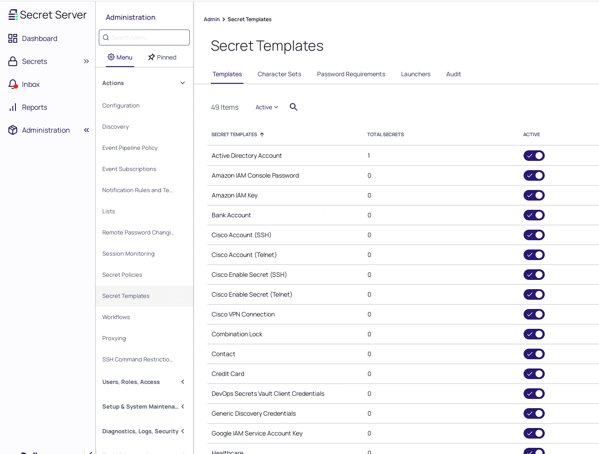
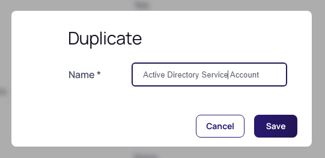
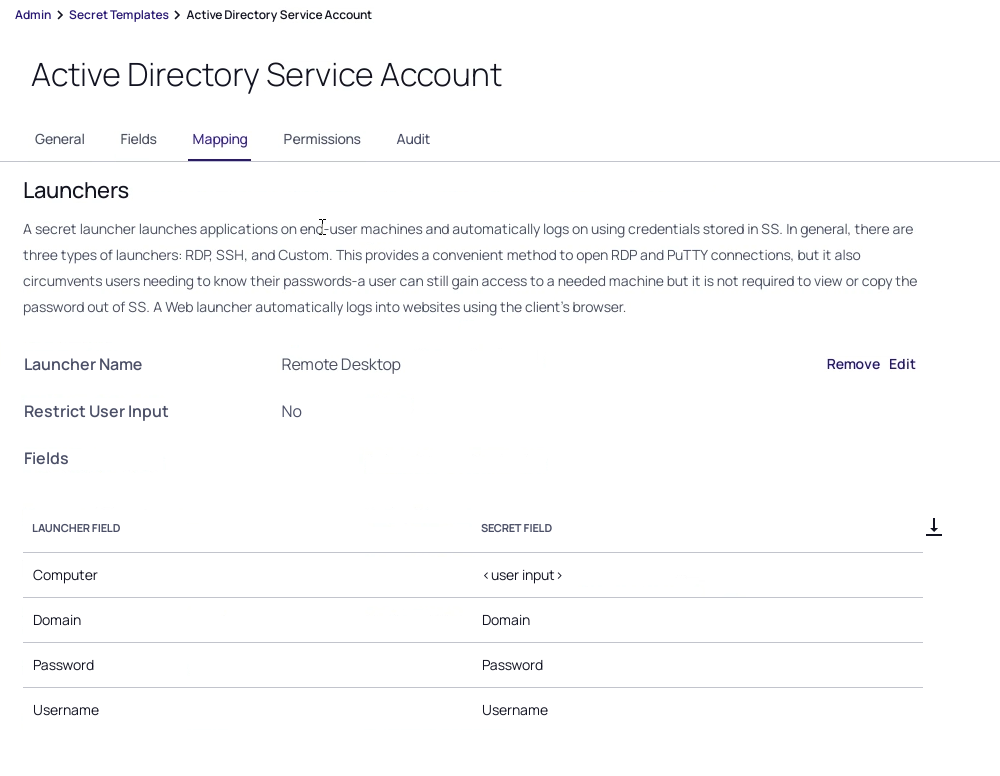
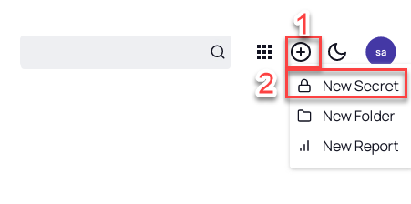
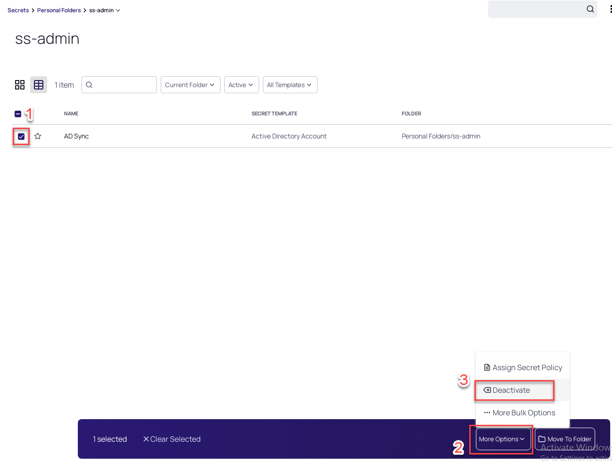

# Secret Templates

## Introduction

This fifth module will cover:

1. Discuss built-in Secret Templates
2. Create a Secret Template

## Built-In Secret Templates

When creating new secrets, a template is used to determine what information the secret should hold, password complexity requirements, launcher configuration and many other secret settings

Secret Server comes with a range of built-in secret templates. These templates can be viewed and edited by navigating to Admin>Secret Template and selecting the relevant template:

!!!Note
      Demo: At this point your trainer will demonstrate and explain the available configuration options within a Secret Template

### Lab 13 - Creating a Secret Template for Active Directory Service Accounts

In this exercise we will be creating a Secret template that can be used for Active Directory service accounts. This template will be the same as the regular AD template, but we will remove the launcher. Because service accounts are used to provide a security context to an application, users should not be able to use the account interactively with a launcher.

As, in this case the Secret Template we are creating is very similar to the existing Active Directory account template we will create a copy rather than starting from scratch.

1. Navigate to the **Administration > Actions > Secret Templates** page

2. Click **Active Directory Account**

3. Click **Duplicate**

      

4. In the name new secret dialogue type: **Active Directory Service Account**

      

5. Click **Save**

6. In the new template select the **Mapping** tab and scroll down to the *Launchers* section

      

7. Click **Remove** next to the **Launcher Name**

8. Click **OK** in the warning box

We will now use this template to recreate the secret used Active Directory integration.

1. Navigate to the **Secrets** and click the **double arrows**

2. Select the **TSS Service Accounts** folder

3. Click the **+** Icon and select **New Secret**

      

4. The new secret dialogue appears, select the newly created **Active Directory Service Account** template

5. Add the following detail into the secret:

   - **Secret Name:** AD Sync
   - **Domain:** thylab.local
   - **Username:** svc_sync
   - **Password:** *Provided by Trainer*
   - **Notes:** type used for active directory integration and synchronization in Secret Server

6. Click **Create Secret**

!!!Note
      The new secret we have created does not have an RDP launcher so users cannot interactively use the credential from Secret Server.

We can now delete the first AD Sync secret from the Ss_admin personal folder

01. Open **Personal Folders > ss_admin**

02. Check the box next to the **AD Sync** secret

03. In the message bar that appears at the bottom, click **More Options** and select Deactivate

      

04. In the *Confirm Bulk Deactivate* windows click **Confirm Action**

05. After the task completed, click **Close**

      

06. No secrets will be left in this folder

07. Now navigate to **Administration (double arrows) > Users, Roles, Access > Directory Services**

08. Select the **thylab.local** domain

09. Click **Edit** in the *Active Directory* section

10. Next to **Synchronization Secret**, click **Clear** to remove the secret we previously deleted (*AD Sync (Deleted)*)

11. Click **No Secret Selected** and select the new **AD Sync** secret in the *TSS Service Accounts* folder

12. Click **Validate & Save** to complete