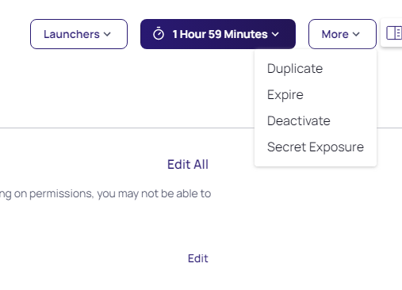
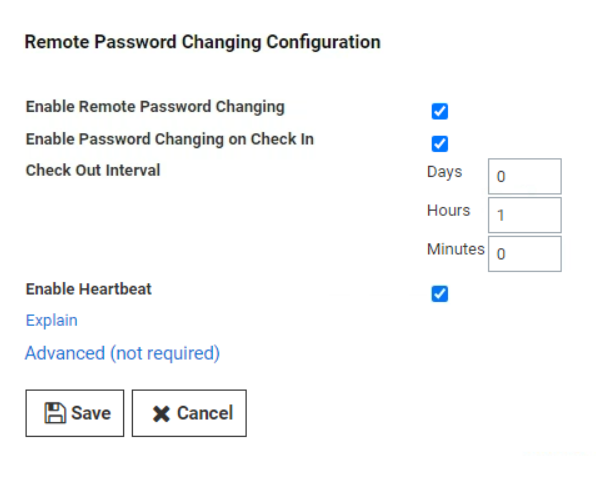
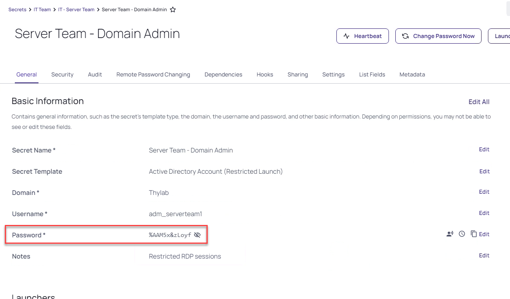
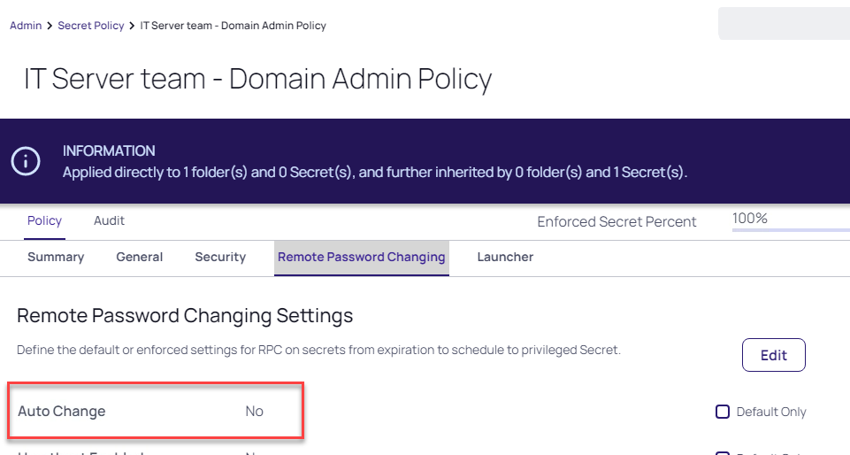
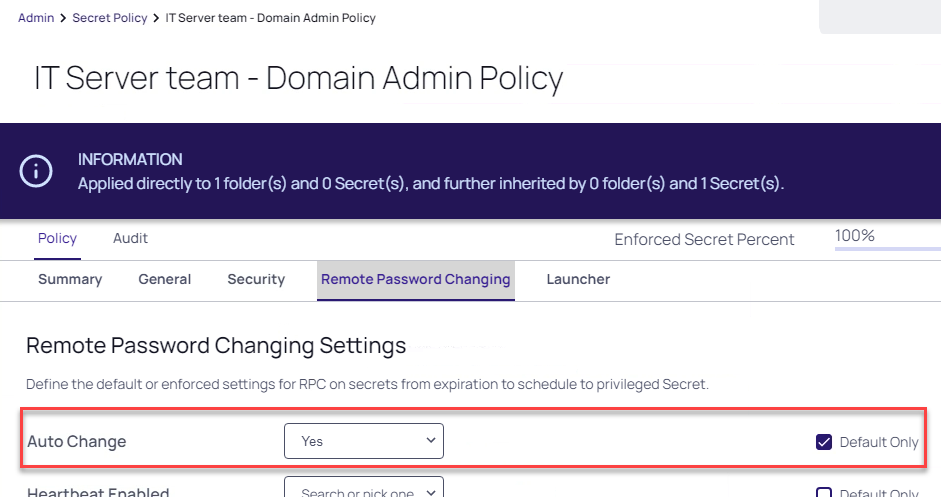
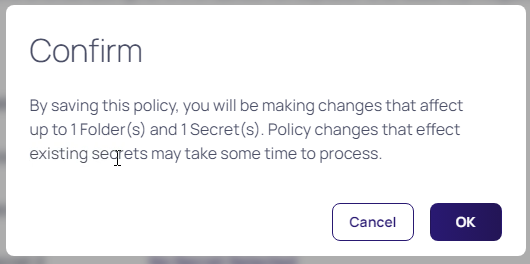
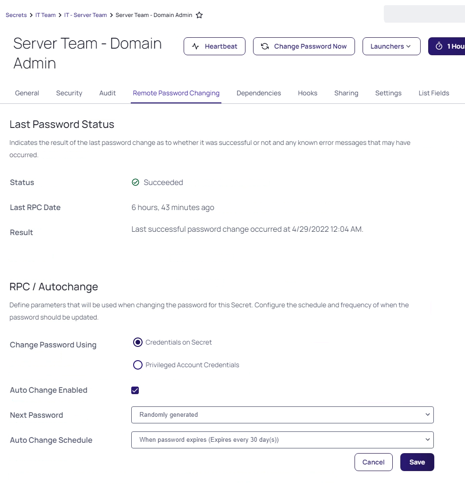

# Remote Password Change (RPC)

## Introduction

This seventh module will cover:

1. RPC Overview
2. Auto change password using RPC

## RPC Overview

As well as storing the credentials of privileged accounts, Secret Server provides the ability to rotate or change passwords for corresponding accounts in Active Directory, local machines, Unix/Linux machines or other devices manually or via an automated schedule. This functionality ensures you that all accounts can be configured to meet your internal password expiration or rotation policy or external compliance rules that you need to adhere to.

### Lab 18 - RPC activation (pre/Post situation)

#### Checking current situation

1. Navigate to the **Secrets (double arrows) > IT Team > IT - Server Team**

2. Open the **Server Team - Domain Admin** secret, as the policy is still active, click **Enter Comment**, provide comment and click **Check Out Secret**

3. Click the **More** button in the top right corner. You should see something like the below screenshot:

   

#### Enabling RPC

1. Navigate to **Administration (double arrows) > Actions > Remote Password Changing**

2. Click **Edit**

3. Check **Enable Remote Password Changing**

4. Check **Enable Password Changing on Check In**

5. Set the **Check Out Interval** to **Hours 1**

6. Check **Enable Heartbeat**

7. Your configuration should match the image below:

      

8. Click **Save**

#### Post enabling RPC

1. Navigate to the **Secrets (double arrows) > IT Team > IT - Server Team**

2. Open the **Server Team - Domain Admin** secret

3. You will now see two new options as buttons

      

### Lab 19 - Manually changing a password

Now that RPC has been enabled, all secrets will have a Change Password Now and Heartbeat button visible in the secret view. This allows a user with the relevant permission to change a password at any time.

1. Within the Secret click **Change Password Now** the change password dialogue is displayed:

2. Choose **Randomly Generated**

      

3. Click **Change Password**

4. At the top of the secret the following message is displayed:

      

5. This bar will disappear once the password has changed. To check the new password, click on the {fa}`eye` icon next to *Password* to see the password (your password will be different)

      

## RPC Auto Change

As we have previously seen, once RPC is configured users within sufficient permissions can manually rotate and validate passwords whenever required. For many secrets we will want to ensure that passwords are rotated on a regular schedule without the need for user intervention.

For automatic password changing there are a number of configuration options to consider:

- The Secret Template used to configure the secret must have password changing enabled

- The Expiration Days field on the secret template or secret itself (Once the secret has expired, remote password configuration will apply)

- Is Remote Password Changing configured within the applied secret policy?

  

- Is remote password changing configured on the secret itself (*Remote Password Changing* tab)?

  

!!!Note
         The fact that RPC can be configured (and enforced) provides a high level of granularity.

If **ALL** secrets with a specific policy require RPC, then this should be enforced. Otherwise the RPC option in the secret policy can be left unset and RPC can be configured on individual secrets.

### Lab 20 - Configuring RPC auto change

In this exercise we will assume that all secrets with the IT Server Team - Domain Admin Policy applied should be configured for RPC auto change.

01. Navigate to **Administration (double arrows) > Actions > Secret Policy**

02. Click **IT Server Team - Domain Admin Policy**

03. Click the **Remote Password Changing** tab

04. Click **Edit**

05. Set the **Auto Change** to **Yes** and make sure that the *Default Only* is checked

    

06. Scroll to the bottom of the screen and click **Save**

07. As setting will actively change settings on existing secrets, the following warning is shown:

    

08. Click **Ok**

09. To validate, navigate to the **Secrets (double arrows) > IT Team > IT - Server Team**

10. Open the **Server Team - Domain Admin** secret, as the policy is still active, click **Enter Comment**, provide comment and click **Check Out Secret**.

11. Click the **Remote Password Changing** tab and the **Auto Change Enabled** should read *Yes*. Also a schedule should be sown.

    

12. Click **Save**