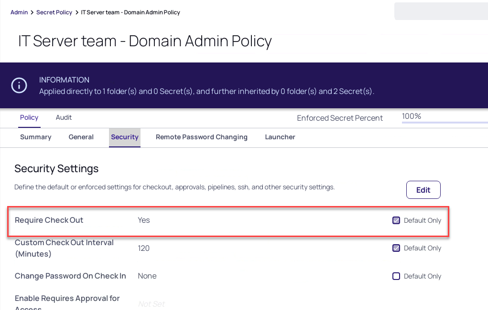
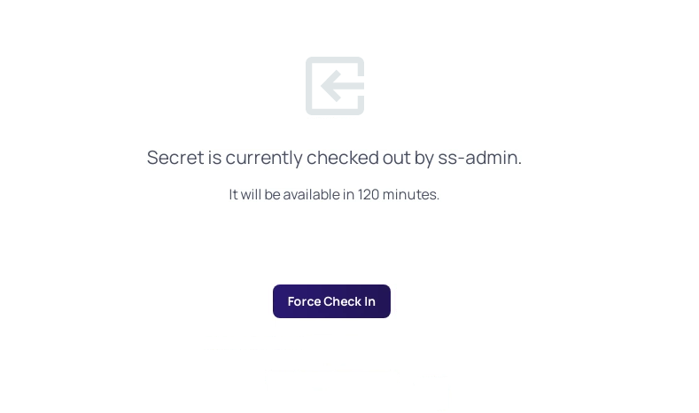
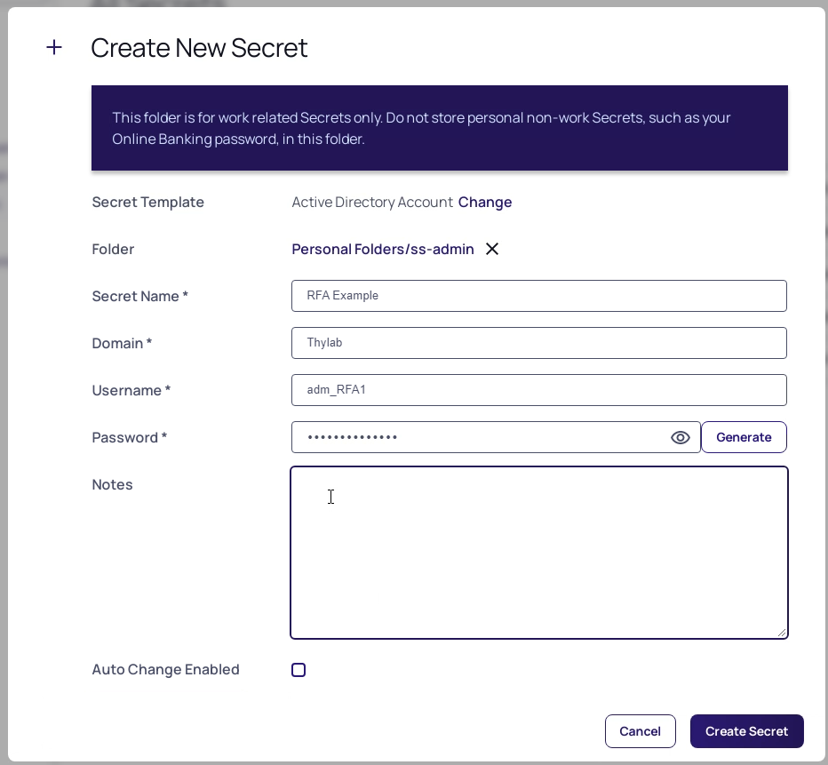
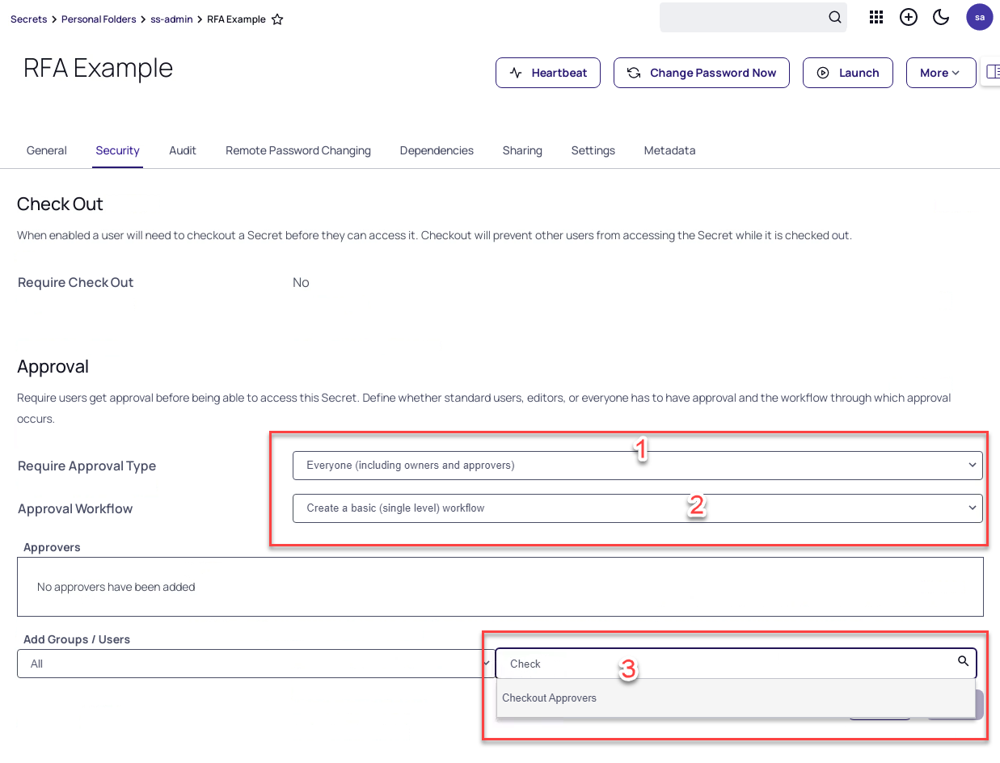
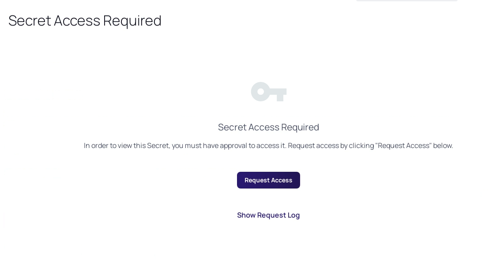
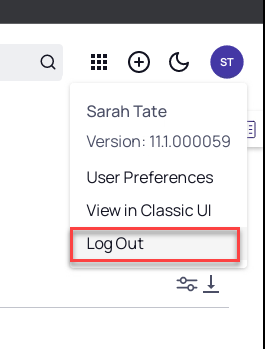
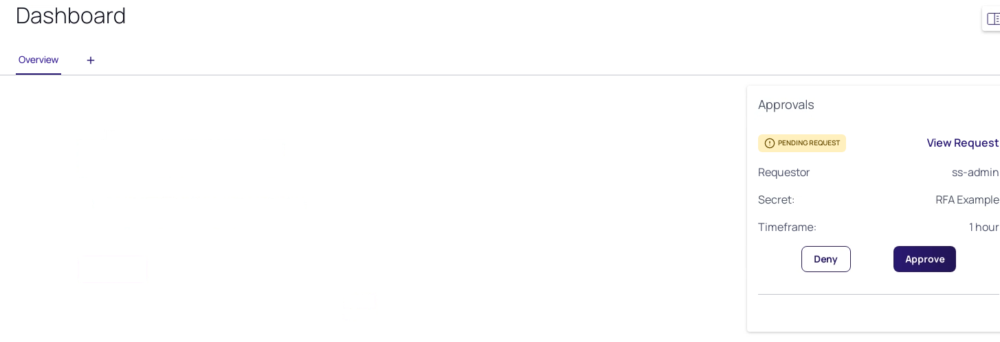

# Secret Workflows

## Introduction

This eighth module will cover:

1. Checkout workflows
2. Request for access workflows

## Overview

In some situations, even when users have permissions to view or edit Secrets we may want to 'gate' access to the Secret with a workflow. There are a range of workflow options available within Secret Server that include:

- Checkout
- Request For Access
- Require Comment
- ITSM ticket Validation

Each of the above options can be used in isolation or together to create highly customisable workflows.

### Checkout

The TSS checkout feature forces accountability on secrets by granting exclusive access to a single user. If a secret is configured for check out, a user can then access it. If Change Password on Check In is turned on, after check in, SS automatically forces a password change on the remote machine. No other user can access a secret while it is checked out, except unlimited administrators. This guarantees that if the remote machine is accessed using the secret, the user who had it checked out was the only one with proper credentials at that time.

There are a range of potential benefits to using Checkout, typically organisations have a one-to-one mapping for users and privileged accounts to ensure actions performed under the context of a given privileged account can always be attributed to an individual. This results in organisations having high volumes of privileged accounts. Checkout enables organisations to drastically reduce the number of privileged accounts while maintaining a full audit trail where any activity can be associated to an individual user.

#### Lab 21 - Enabling Checkout

Before enabling checkout, we will create an example secret. As with virtually all Secret security settings, checkout can be applied on individual secrets or from a Secret Policy.

01. Navigate to **Secret (double arrows) > IT Team > IT - Server Team** folder then click the **+** Icon to create a new secret

02. Select the *Active Directory Account* Template

03. Create the secret with the following information

    - **Secret Name:** Checkout Example
    - **Domain:** Thylab
    - **Username:** adm_checkout1
    - **Password:** *Provided by Trainer*

04. Your configuration should match the image below:

    

05. Click **Create Secret**

06. Open the **Checkout Example** secret, as the folder policy is still active, click **Enter Comment**, provide comment and click **Check Out Secret**

07. Navigate to the **Security** tab of the Secret.

08. In the *CheckOut* section click **Edit** then see that you are able to uncheck **Require Check Out**. Leave it *Checked*

    !!!Note
        The reason for being able to do this, is that the created Secret Policy is set to *Default Only*

        

        The default checkout interval value can be configured from **Administration > Actions > Remote Password Changing**):

09. Click **Save**

10. Open a new Incognito Window and navigate to https://sspm.thylab.local/SecretServer

11. In the login screen, use the following parameters:

    - **Username:** STate
    - **Password:** *Provided by Trainer*
    - **Domain:** Thylab (we are going to use the AD to authenticate the user. *Local* means a local user in Secret Server)

12. Click **Log in**

13. Navigate to **Secret > IT Team > IT - Server Team** folder and try to open the **Checkout Example** secret

14. A screen will be shown that the secret is checked out and by whom. Account *STate* has the "power" to force the Check in.

    

    !!!Note
        In certain scenarios organisations may need the ability to force the check in of a Secret. To do that a user must have at least **View permission** on the secret **AND** the **Force Check In** permission in their assigned role.)

15. Switch back to the Chrome session where the ss-admin account is logged in and check the secret back in by clicking on the time remaining before auto check in and click **Check In**

    

### Request for Access

Request For access ensures that before a user can access a secret they must make a request to do so, which then needs to be approved by an approver or multiple approvers depending on the workflow configuration

- Establishing a workflow model, the user must request access from the approval group or groups.
- An email is sent to everyone in the approval groups, notifying them of the request.
- The request can be approved or denied by any members of the approval groups.
- If Owners and Approvers also Require Approval is enabled, then even owners or those in an approval group needs to request access.

There are two types of access request workflow available within Secret Server:

- Basic Workflows - a list of individual users or groups are defined as approvers, any single user can approve or deny the request
- Multi-Tier Workflows - Allow for complex multi-tier workflows (max. 15 steps) where specific approval requirements can be specified at each tier. For more information see: <https://docs.thycotic.com/ss/11.0.0/secret-workflow-templates/index.md>

#### Lab 22 - Enabling Request for Access

Before enabling request for access, we will create an example secret. As with virtually all Secret security settings, request for access can be applied on individual secrets or from a Secret Policy.

01. Navigate to **Secrets (double arrows) > IT Team > IT - Server Team** folder then click the **+** Icon to create a new secret

02. Select the *Active Directory Account* Template

03. Create the secret with the following information

    - **Secret Name:** RFA Example
    - **Domain:** Thylab
    - **Username:** adm_RFA1
    - **Password:** *Provided by Trainer*

04. Your configuration should match the image below:

    

05. Click **Create Secret**

06. Navigate to the **Security** tab of the Secret

07. Under *Approval*, click **Edit**

08. From the *Require Approval Type* dropdown, select **Everyone (including owners and approvers)**

09. In the *Approval Workflow* field, select **Create a basic (single level) workflow**

10. Under *Approvers*, search for and select the **Checkout Approvers** group we created earlier.

    

11. Click **Save**

12. After you have Clicked the **Save** button, you will get immediately the **Secret Access Required** screen as that is what we have defined.

    

13. Click **Request Access**

14. In the *Duration* field, set to **One Hour**

15. In the *Reason* field, specify the reason why you need access to the Secret

16. Click **Submit Request**

17. You should still have the Incognito Window where you logged in a s STate in the Thylab domain. If so, please log out the STate account by clicking the initials **ST** in the right top corner and select **Log Out**.

    

18. Click the **Log In** button

19. Log in using the following

    - **Username:** BSaunders
    - **Password:** *Provided by Trainer*
    - **Domain:** Thylab

20. Navigate to the **Dashboard**

21. On the right of the screen you will see the pending approval request:

    

22. Click **Approve**

23. Provide a reason for approval

24. Click **Confirm Approval**

25. The screen wil have no more Approvals

26. *Go back to the ss_admin user session* and you will be allowed access to see the secret.

27. As the Request is valid for one hour, you will not be prompted for the Request anymore till the time expires.