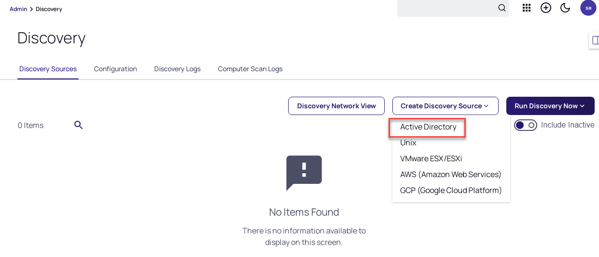

# Discovery

## Introduction

This nineth module will cover:

1. Overview
2. Enable Discovery
3. Configure AD Account Discovery

## Discovery overview

Once basic configuration tasks have been completed such as the creation of folders, templates and policies, secrets can now be added to Secret Server. Although secrets can be added manually this can be time consuming in large environments. Secret Server provides the Discovery functionality to automatically find the following accounts:

- Active Directory user accounts
- Active Directory service accounts
- Local Windows accounts
- Unix / Linux accounts
- VMware ESX/ESXi accounts
- Many more with extensible discovery

Once found, accounts can then automatically be pulled into Secret Server. The configured secret templates, folder structure and policies will ensure that secrets have all relevant settings automatically applied.

### Lab 23 – Enabling Discovery

1. Navigate to **Administration > Actions > Discovery**
2. Click **Continue**
3. Click on **Enable Discovery**
4. Click on **Enable Discovery** to confirm *Enable Discovery*

Now that discovery is enabled, we can start to create discovery sources to look for accounts in different locations. In this section we will perform discovery in the following areas:

- Active Directory
- Local Windows Accounts
- Linux / Unix Accounts

### Lab 24 – Configuring Active User Account Directory Discovery

01. While still at **Administration > Actions > Discovery** page, click **Create Discovery Sources**

02. Click **Active Directory**

    

03. Create the Discovery Source with the Following details:

    - **Discovery Source Name:** thylab.local
    - **Fully Qualified Domain Name:** thylab.local
    - **Friendly Name:** Thylab
    - **Active:** True
    - **Discovery Secret:** Select *AD Sync* Account by clicking the *No secret Selected*
    - *Leave the rest of the options default*

04. It should look like:

    

05. Click **Create**

06. In the new screen, *Add Discovery Scanners*, make sure that under *Find Dependencies* also **Application Pool** and **COM+ Applications** are checked

    

07. Click **Save**

08. Click **Discovery** in the top of the screen on the left hand side

    

09. Click **Run Discovery Now > Run Discovery Scan**

    !!!Note
        For more information on the permissions required by accounts used for discovery purposes check the following KB article: <https://thycotic.force.com/support/s/article/Account-Permissions-for-Discovery?topicName=Secret+Server&topicId=0TO370000008fpDGAQ>)

10. On the Left side, under *Discovery* you can find the latest information on the Discovery Run. Also in the **SOURCE LAST RUN** you can see the date and time information.

    

11. To view and explore the results, click the **Discovery Network View** button

    !!!Note
        Demo: Your trainer will now demo several options around importing secrets from Discovery and creating automated discovery rules.
